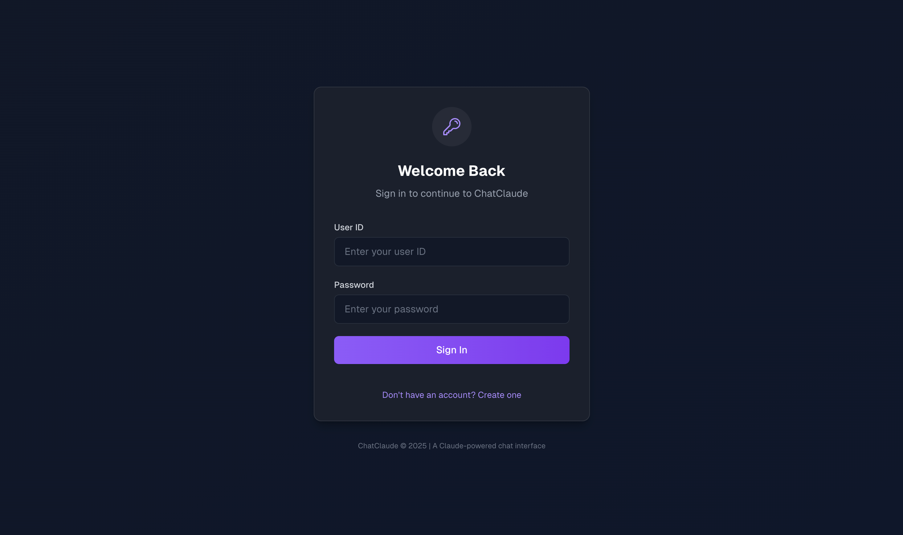

# 🤖 ChatClaude

A modern chat application with Claude API integration, built using Next.js and Tailwind CSS.

**Login page**



**Main Interface**


## ✨ Features

- 💬 **Chat Threads** - Create and manage multiple conversations
- 🧠 **Model Selection** - Choose between different Claude models
- 🔒 **User Authentication** - Secure login with user-specific threads
- 💾 **Flexible Storage** - Local storage or Supabase integration
- ✍️ **Markdown Support** - Rich text formatting in messages

## 🚀 Setup

1. Clone the repository
   ```bash
   git clone https://github.com/vernonwu/ChatClaude.git
   cd ChatClaude
   ```

2. Install dependencies:
   ```bash
   npm install
   ```

3. Create a `.env.local` file:
   ```
   NEXT_PUBLIC_CLAUDE_API_KEY=your_claude_api_key_here
   
   # Optional Supabase configuration
   NEXT_PUBLIC_SUPABASE_URL=your_supabase_url_here
   NEXT_PUBLIC_SUPABASE_ANON_KEY=your_supabase_anon_key_here
   
   # Optional HTTP proxy configuration
   HTTP_PROXY_HOST=your_proxy_host
   HTTP_PROXY_PORT=your_proxy_port
   ```

4. Start the development server:
   ```bash
   npm run dev
   ```

5. Open [http://localhost:3000](http://localhost:3000)

## 📊 Storage Options

- **📱 Local Storage (Default)** - Browser-based, single-device
- **☁️ Supabase Storage (Optional)** - Multi-device sync with authentication

## 🛠️ Database Setup with Supabase

1. Create a new [Supabase](https://supabase.com) project
2. Add credentials to `.env.local`
3. Run the SQL from `supabase_setup.sql` in Supabase SQL Editor

## 🔧 Technologies

- ⚛️ [Next.js 14](https://nextjs.org/)
- 📘 [TypeScript](https://www.typescriptlang.org/)
- 🎨 [Tailwind CSS](https://tailwindcss.com/)
- 🐻 [Zustand](https://github.com/pmndrs/zustand)
- 🧠 [Claude API](https://anthropic.com/claude)
- 🗄️ [Supabase](https://supabase.com)
- 🎭 [Heroicons](https://heroicons.com/)

## 👥 Contributing

Contributions are welcome! Please feel free to submit a Pull Request.

## 📝 License

This project is licensed under the MIT License.

## ⭐ Star History

[](https://star-history.com/#vernonwu/ChatClaude&Date)