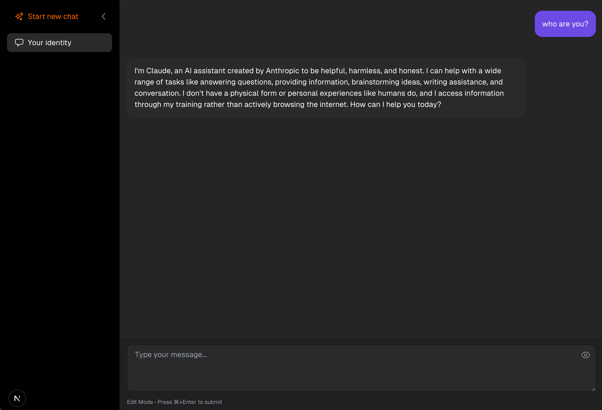

# ChatClaude

A modern chat application built with Next.js and Tailwind CSS that integrates with the Claude API.



Features include:

- Multiple chat threads with history
- Model selection (Claude 3 Opus, Claude 3 Sonnet, Claude 2.1)
- Modern, Claude-inspired UI design
- Flexible storage options (Local storage or Supabase)
- HTTP proxy support for API calls

## Features

- **Chat Threads**: Create and manage multiple conversation threads
- **Model Selection**: Choose between different Claude models
- **Flexible Storage**:
  - Local storage (default) for single-device usage
  - Optional Supabase integration for multi-device sync and persistence
- **Markdown Preview**: Render markdown in chat messages

## Setup

1. Clone the repository
   ```bash
   git clone <repository-url>
   cd claude-chat-app
   ```

2. Install dependencies:
   ```bash
   npm install
   ```

3. Create a `.env.local` file in the root directory and add your Claude API key:
   ```
   NEXT_PUBLIC_CLAUDE_API_KEY=your_claude_api_key_here
   ```

4. (Optional) Configure the HTTP proxy for API calls:
   - Add the following line to `.env.local`:
     ```
     HTTP_PROXY_HOST= {http_proxy_host}
     HTTP_PROXY_PORT= {http_proxy_port}
     ```

5. (Optional) Set up Supabase:
   - Create a new project at [Supabase](https://supabase.com)
   - Add Supabase credentials to `.env.local`:
     ```
     NEXT_PUBLIC_SUPABASE_URL=your_supabase_url_here
     NEXT_PUBLIC_SUPABASE_ANON_KEY=your_supabase_anon_key_here
     ```
   - Run the following SQL in your Supabase SQL editor:
     ```sql
     -- Threads table
     create table threads (
       id text primary key,
       title text not null,
       user_id text not null,
       created_at timestamp with time zone default timezone('utc'::text, now()) not null,
       updated_at timestamp with time zone default timezone('utc'::text, now()) not null
     );

     -- Messages table
     create table messages (
       id text primary key,
       thread_id text references threads(id) on delete cascade,
       role text not null check (role in ('user', 'assistant', 'system')),
       content text not null,
       created_at timestamp with time zone default timezone('utc'::text, now()) not null
     );

     -- Indexes
     create index messages_thread_id_idx on messages(thread_id);
     create index threads_user_id_idx on threads(user_id);
     create index threads_updated_at_idx on threads(updated_at desc);
     ```

   Note: If Supabase credentials are not provided, the app will automatically use local storage.

6. Start the development server:
   ```bash
   npm run dev
   ```

7. Open [http://localhost:3000](http://localhost:3000) in your browser

## Storage Options

### Local Storage (Default)
- Chat history is saved in the browser's local storage
- Data persists across page reloads and browser restarts
- Data is limited to the current device
- No setup required

### Supabase Storage (Optional)
- Chat history is saved in a PostgreSQL database
- Data syncs across multiple devices
- Requires Supabase project setup
- Enable by adding Supabase credentials to `.env.local`

## Technologies Used

- [Next.js 14](https://nextjs.org/) - React framework
- [TypeScript](https://www.typescriptlang.org/) - Type safety
- [Tailwind CSS](https://tailwindcss.com/) - Styling
- [Zustand](https://github.com/pmndrs/zustand) - State management
- [Claude API](https://anthropic.com/claude) - AI model
- [Supabase](https://supabase.com) - Optional database and persistence
- [Heroicons](https://heroicons.com/) - Icons

## Architecture

- **Frontend**: Next.js with TypeScript and Tailwind CSS
- **State Management**: Zustand with persistence middleware
- **Storage**: Local storage (default) or Supabase PostgreSQL (optional)
- **API Integration**: Claude API with HTTP proxy support
- **Styling**: Tailwind CSS with custom variables for theming

## Contributing

Contributions are welcome! Please feel free to submit a Pull Request.

## Learn More

To learn more about Next.js, take a look at the following resources:

- [Next.js Documentation](https://nextjs.org/docs) - learn about Next.js features and API.
- [Learn Next.js](https://nextjs.org/learn) - an interactive Next.js tutorial.

You can check out [the Next.js GitHub repository](https://github.com/vercel/next.js) - your feedback and contributions are welcome!

## Deploy on Vercel

The easiest way to deploy your Next.js app is to use the [Vercel Platform](https://vercel.com/new?utm_medium=default-template&filter=next.js&utm_source=create-next-app&utm_campaign=create-next-app-readme) from the creators of Next.js.

Check out our [Next.js deployment documentation](https://nextjs.org/docs/app/building-your-application/deploying) for more details.

## License

This project is licensed under the MIT License - see the LICENSE file for details.

## Star History

[](https://star-history.com/#vernonwu/ChatClaude&Date)